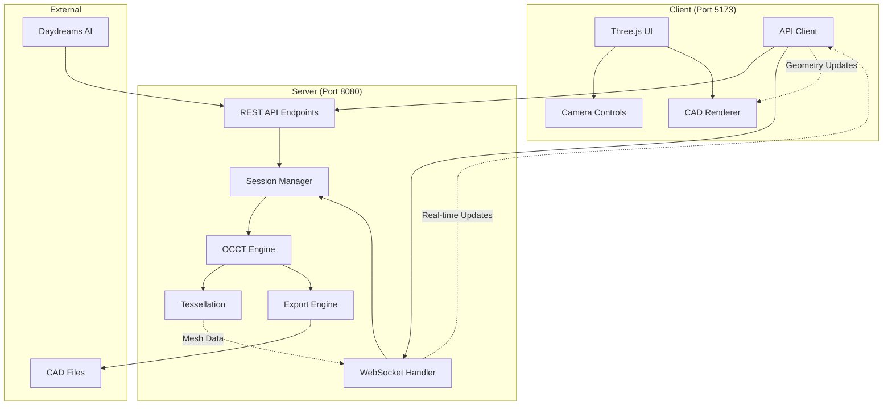
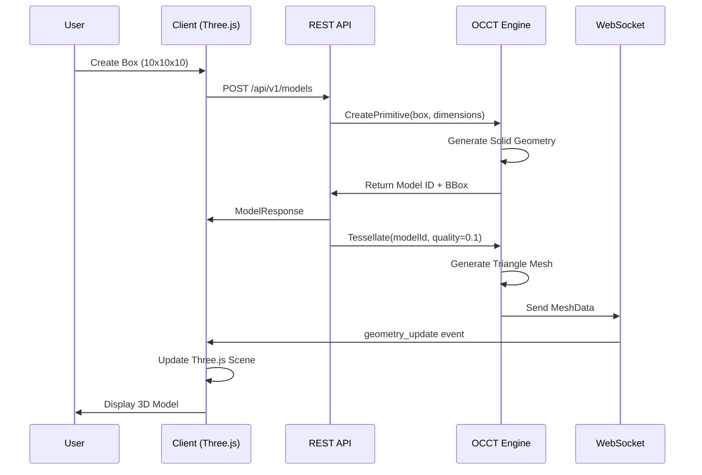

# CAD Engine - Professional 3D CAD Application

A sophisticated CAD application built to replace OpenSCAD in the Daydreams AI workflow. Features a powerful **OpenCASCADE (OCCT)** server backend with a modern **Three.js** client frontend.


## 🎯 Project Overview

This CAD engine provides:

- **🔧 Professional CAD Backend**: OpenCASCADE (OCCT) C++ server for robust geometric modeling
- **🎨 Modern 3D Frontend**: Three.js TypeScript client with professional viewport controls  
- **⚡ Real-time Updates**: WebSocket communication for live geometry updates
- **🔗 REST API**: Complete CRUD operations for CAD models and parameters
- **🤖 AI Integration**: Daydreams AI compatible endpoints for natural language CAD operations
- **📤 Multi-format Export**: STEP, STL, OBJ, IGES format support

## 🏗️ Architecture

### System Overview



### Data Flow



## 🚀 Quick Start

### Prerequisites

**All Platforms:**
- **CMake 3.20+** 
- **Node.js 18+**
- **OpenCASCADE 7.7+**
- **C++ Compiler** (Visual Studio 2022, GCC 10+, or Clang 12+)

**Platform-Specific Dependencies:**

#### Windows Requirements
- **Visual Studio Build Tools 2022** (C++ compiler)
- **OpenCASCADE 7.7+** (Windows VC++ 2022 64-bit package + 3rd party)

*Third Party Includes:*
- **Intel TBB** (Threading Building Blocks)
- **jemalloc** (Memory allocator)

*Third party in the installer includes much more but those packages are essential to the build*

#### Linux Requirements (Ubuntu/Debian)
- **Build essentials**: `build-essential`, `cmake`, `git`
- **OpenCASCADE**: Available via package manager or source build
- **Additional libraries**: `libtbb-dev`, `libjemalloc-dev`

#### macOS Requirements
- **Xcode Command Line Tools** or **Xcode**
- **Homebrew** package manager
- **OpenCASCADE**: Available via Homebrew

### 1. Install System Dependencies

#### Windows Setup

```bash
# Install CMake
winget install Kitware.CMake

# Install Node.js
winget install OpenJS.NodeJS

# Download and install:
# - OpenCASCADE: https://dev.opencascade.org/release (Windows VC++ 2022 64 bit)
# - Visual Studio Build Tools 2022: https://visualstudio.microsoft.com/downloads/
```

#### Linux Setup (Ubuntu/Debian)

```bash
# Update package manager
sudo apt update

# Install build tools
sudo apt install build-essential cmake git curl

# Install Node.js (via NodeSource)
curl -fsSL https://deb.nodesource.com/setup_18.x | sudo -E bash -
sudo apt install -y nodejs

# Install OpenCASCADE and dependencies
sudo apt install libocct-foundation-dev libocct-modeling-data-dev \
                 libocct-modeling-algorithms-dev libocct-visualization-dev \
                 libocct-application-framework-dev libocct-data-exchange-dev \
                 libtbb-dev libjemalloc-dev

# Alternative: Install from source
# wget https://git.dev.opencascade.org/gitweb/?p=occt.git;a=snapshot;h=refs/tags/V7_7_0;sf=tgz
# tar -xzf occt-V7_7_0.tar.gz && cd occt-V7_7_0
# mkdir build && cd build
# cmake .. -DCMAKE_BUILD_TYPE=Release -DCMAKE_INSTALL_PREFIX=/usr/local
# make -j$(nproc) && sudo make install
```

#### macOS Setup

```bash
# Install Homebrew (if not installed)
/bin/bash -c "$(curl -fsSL https://raw.githubusercontent.com/Homebrew/install/HEAD/install.sh)"

# Install dependencies
brew install cmake node opencascade tbb jemalloc

# Install Xcode Command Line Tools (if not installed)
xcode-select --install
```

### 2. Clone and Setup

```bash
git clone <repository-url>
cd Dimes

# Install client dependencies
cd client
npm install
cd ..
```

### 3. Build OCCT Server

#### Windows Build
```bash
cd server

# Create build directory
mkdir build
cd build

# Configure with CMake (Windows)
cmake .. -DCMAKE_BUILD_TYPE=Release

# Build
cmake --build . --config Release

cd ..
```

#### Linux/macOS Build
```bash
cd server

# Create build directory
mkdir build
cd build

# Configure with CMake
cmake .. -DCMAKE_BUILD_TYPE=Release

# Build with multiple cores
make -j$(nproc)  # Linux
# make -j$(sysctl -n hw.ncpu)  # macOS

cd ..
```

### 4. Run the Application

#### Terminal 1: Start OCCT Server

**Windows:**
```bash
cd server/build/Release
./cad-engine-server.exe
```

**Linux/macOS:**
```bash
cd server/build
./cad-server
```

You should see:
```
[INFO] Starting CAD Engine Server on port 8080
[INFO] OpenCASCADE Engine initialized successfully
[INFO] Session Manager ready
[INFO] Server is ready to accept connections
```

#### Terminal 2: Start Client Development Server
```bash
cd client
npm run dev
```

You should see:
```
VITE v4.5.14  ready in 175 ms
➜  Local:   http://localhost:5173/
```

### 5. Open Application

Navigate to `http://localhost:5173` in your browser.

**Expected Result:**
- ✅ Green status bar: "CAD Engine ready! 🎉"
- ✅ 3D viewport with grid, axes, and demo geometry
- ✅ Mouse controls: orbit, pan, zoom
- ✅ Keyboard shortcuts: Ctrl+1/2/3/0 for view changes

## 🛠️ Development Setup

### Project Structure

```
Dimes/
├── client/                 # Three.js TypeScript frontend
│   ├── src/
│   │   ├── api/           # OCCT server communication
│   │   ├── renderer/      # Three.js 3D rendering
│   │   ├── controls/      # Camera and viewport controls
│   │   ├── mesh/          # Geometry processing
│   │   ├── types/         # TypeScript definitions
│   │   └── main.ts        # Application entry point
│   ├── public/            # Static assets
│   └── package.json       # Node.js dependencies
├── server/                # OCCT C++ backend
│   ├── include/           # Header files
│   │   ├── api/           # REST API handlers
│   │   ├── geometry/      # OCCT geometry operations
│   │   ├── session/       # Session management
│   │   └── tessellation/  # Mesh generation
│   ├── src/               # Implementation files
│   └── CMakeLists.txt     # Build configuration
├── shared/                # Shared type definitions
└── Docs/                  # Documentation
```

### Development Commands

#### Client Development
```bash
cd client

# Start development server with hot reload
npm run dev

# Build for production
npm run build

# Type checking
npm run type-check

# Linting
npm run lint
```

#### Server Development
```bash
cd server

# Clean build
rm -rf build/
mkdir build && cd build

# Debug build
cmake .. -DCMAKE_BUILD_TYPE=Debug
cmake --build . --config Debug

# Run with debug output
./Debug/cad-engine-server.exe --verbose
```

### API Testing

#### Health Check
```bash
curl http://localhost:8080/api/v1/health
```

#### Create Geometry
```bash
curl -X POST http://localhost:8080/api/v1/models \
  -H "Content-Type: application/json" \
  -d '{
    "session_id": "test-session",
    "operation": "create_model",
    "parameters": {
      "type": "primitive",
      "primitive_type": "box",
      "dimensions": {"width": 10, "height": 10, "depth": 10}
    }
  }'
```

## 📖 Key Features

### 🎮 Interactive Controls

- **Mouse Navigation**: Orbit, pan, zoom with Three.js OrbitControls
- **Keyboard Shortcuts**: 
  - `Ctrl+1`: Front view
  - `Ctrl+2`: Top view  
  - `Ctrl+3`: Right view
  - `Ctrl+0`: Isometric view

### 🔧 CAD Operations

- **Primitive Creation**: Box, cylinder, sphere, cone
- **Boolean Operations**: Union, cut, intersection
- **Parametric Updates**: Real-time parameter modification
- **Export Formats**: STEP, STL, OBJ, IGES

### 🤖 AI Integration

- **Daydreams Compatible**: Natural language CAD instructions
- **REST Endpoints**: `/api/v1/daydreams/cad`
- **Streaming Responses**: Real-time geometry updates

### ⚡ Performance

- **WebSocket Updates**: Sub-100ms geometry updates
- **Efficient Tessellation**: Configurable mesh quality
- **Session Management**: Multi-user support
- **Memory Management**: RAII and smart pointers

## 🐛 Troubleshooting

### Common Issues

#### Server Won't Start
```
Error: OCCT libraries not found
```
**Solution**: Ensure OpenCASCADE is installed and `CMAKE_PREFIX_PATH` includes OCCT directory.

#### Missing DLL Errors
```
Error: tbb12.dll not found
```
**Solution**: Install Intel TBB and add to PATH, or copy DLLs to server directory.

#### Client Connection Failed
```
Error: Server offline - running in demo mode
```
**Solution**: Verify server is running on port 8080 and not blocked by firewall.

#### Compilation Errors
```
Error: C2039 'Nodes' is not a member of 'Poly_Triangulation'
```
**Solution**: Ensure OpenCASCADE 7.7+ is installed (newer API required).

### Debug Mode

Enable verbose logging:
```bash
# Server debug
./cad-engine-server.exe --verbose --log-level=debug

# Client debug (browser console)
localStorage.setItem('debug', 'cad:*')
```

## 🤝 Contributing

1. **Fork** the repository
2. **Create** a feature branch: `git checkout -b feature/amazing-feature`
3. **Commit** changes: `git commit -m 'Add amazing feature'`
4. **Push** to branch: `git push origin feature/amazing-feature`
5. **Open** a Pull Request

## 📄 License

This project is licensed under the MIT License - see the [LICENSE](LICENSE) file for details.

## 🙏 Acknowledgments

- **OpenCASCADE**: Powerful 3D modeling kernel
- **Three.js**: Excellent 3D graphics library
- **Vite**: Fast development build tool
- **TypeScript**: Type-safe JavaScript development

---

**Built with ❤️ for the Daydreams AI ecosystem** 